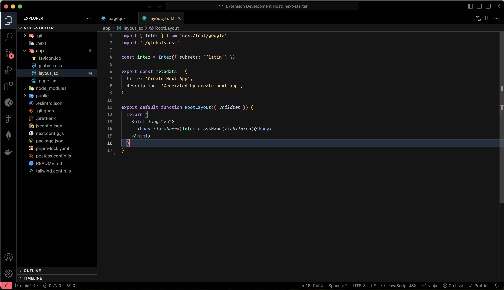
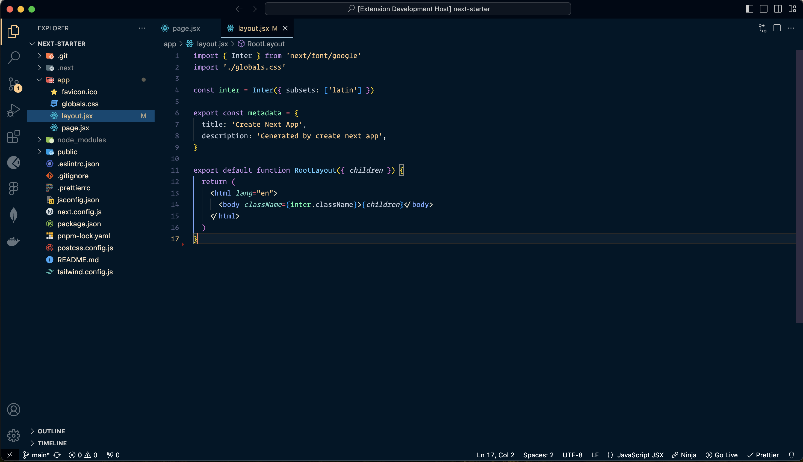
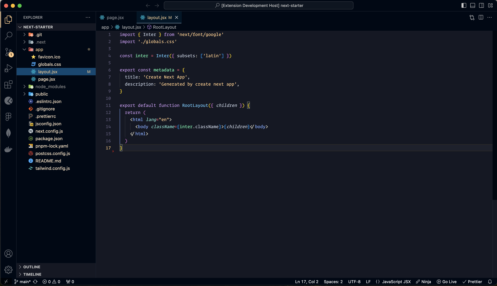
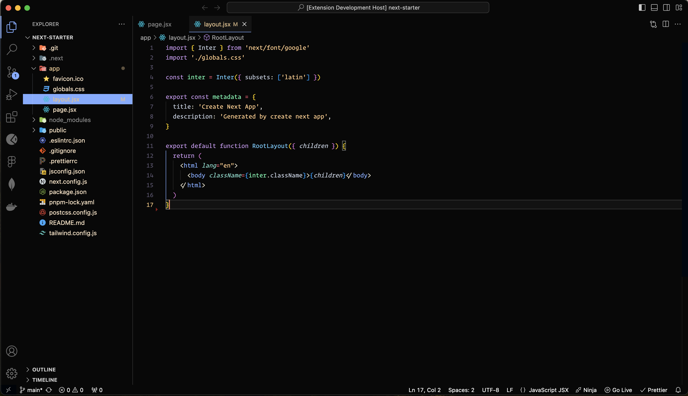
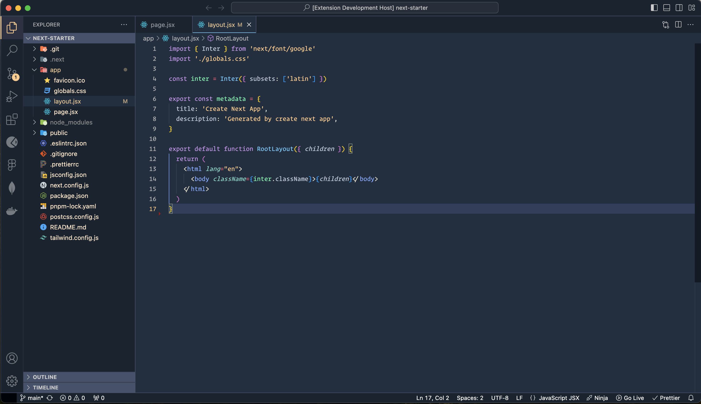

# Dark Alchemy Themes

<table  style="width:100%">
  <tr>
    <td>
       
      <h5>DA-Default</h5>
    </td>
    <td>
      
      <h5>DA-Blue</h5>
    </td>
  </tr>
  <tr>
     <td>
       
      <h5>DA-Midnight</h5>
    </td>
    <td>
      
      <h5>DA-Black</h5>
    </td>
  </tr>
  <tr>
    <td>
       
      <h5>DA-Arctic</h5>
    </td>
    <td>
      
      <h5>DA-Arctic-Ruled</h5>
    </td>
  </tr>
</table>

## Install

1. Visit the [VS Marketplace](https://marketplace.visualstudio.com).
2. Click on the "Install" button.
3. Then [select a theme](https://code.visualstudio.com/docs/getstartedthemes#_selecting-the-color-theme).The GitHub themes aim to align with the themes available in [github.com's settings](https://github.com/settings/appearance):
    - `DarkAlchemy - Default`
    - `DarkAlchemy - Blue`
    - `DarkAlchemy - Midnight`✨ new ✨
    - `DarkAlchemy - Black` ✨ new ✨
    - `DarkAlchemy - Arctic`
    - `DarkAlchemy - Arctic-Ruled` ✨ new ✨

## Customize this theme

To customize this theme (or any other) in your personal config file, refer to the guide in the [color theme](https://code.visualstudio.com/api/extension-guides/color-theme) documentation. This is useful for making small adjustments to the theme without forking and managing your separate theme.

## Contribution Guide

<b>Note: PR for only current themes as of now.</b> 

1. Clone this [repo](https://github.com/dark-alchemy/darkalchemy) in VS Code.
2. To access the "darkalchemy" folder, either navigate through the file explorer manually or execute the command `code darkalchemy` in the Command Line Interface (CLI).
3. Press `F5` to open a new window with your extension loaded
4. Navigate to `Code > Preferences > Color Theme` or use shortcuts (`⌘k ⌘t` on Mac or `Ctrl+k Ctrl+t` on Windows) and select the "Darkalchemy ..." theme for testing.
5. Make desired changes to the themes file.
    - **UI**: For alterations to the "outer UI" such as the status bar, file navigation, etc., refer to the [Theme Color](https://code.visualstudio.com/api/references/theme-color) reference.
    - **Syntax**:  For modifications to code highlighting, inspect the syntax scopes by invoking the [`Developer: Inspect Editor Tokens and Scopes`](https://code.visualstudio.com/api/language-extensions/syntax-highlight-guide#scope-inspector) command from the Command Palette (`Ctrl+Shift+P` or `Cmd+Shift+P` on Mac) in the Extension Development Host window.
6. Once you're happy, commit your changes and open a Pull Request (PR).

**Enjoy exploring the Dark Alchemy Themes!**
